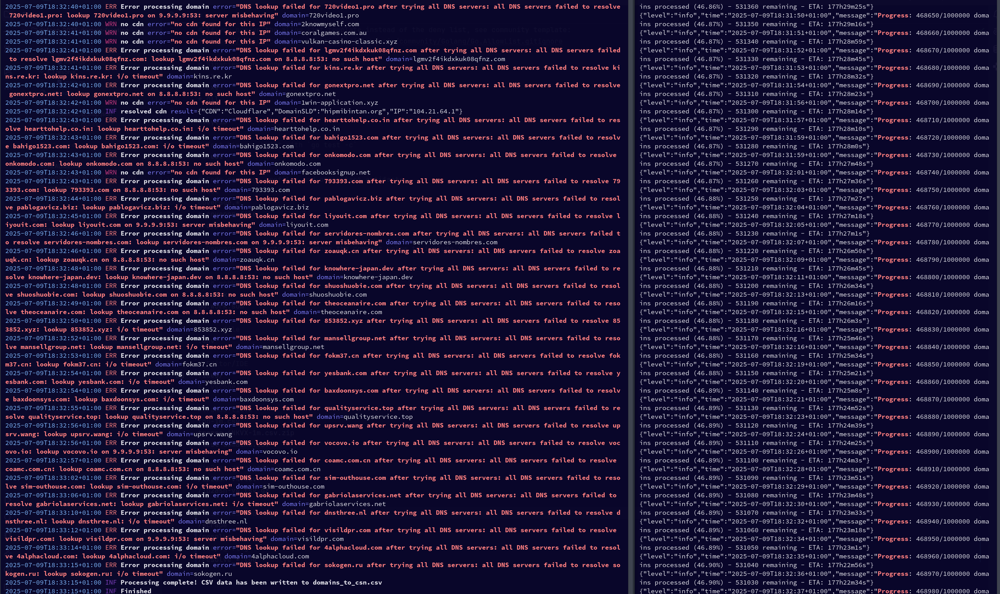
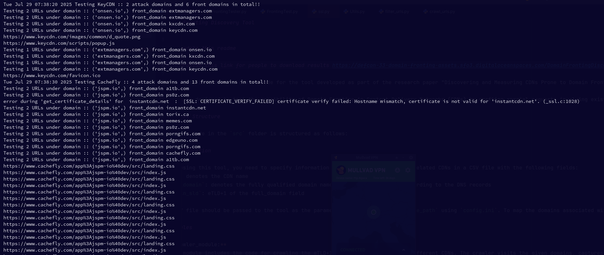

# defcon-33-domain-fronting

Defcon 33 (2025) Malware Village Domain Fronting Talk by Tom Cope

Slides: https://docs.google.com/presentation/d/1KRr4vV09sZf3SNt6_wlnEY7lyhNkWAqYuz1HWK76zO0/edit?usp=sharing

---

Building on the great work of [Karthika Subramani](https://karthikas03.github.io/):
- Paper ~ [Discovering and Measuring CDNs Prone to Domain Fronting (2024)](https://doi.org/10.1145/3589334.3645656)
- Git repo https://github.com/karthikaS03/DomainFrontingDiscovery

Within this repo I improve on the original CDN detection methods by using only open source datasets
and using an ASN -> IP -> CDN lookup system based on DNS resolution.

## 1. CDN List (Manual Process)

To rank and test a collection of CDNs we need a list of CDNs! 

This was gathered through some Googling and manual research
and then [PeeringDB](https://www.peeringdb.com/net/906) and [HackerTarget](https://hackertarget.com/as-ip-lookup/) were used
to associate each CDN with their ASN number. 

We store this list in `cdn_asn.csv`

Data Collection Date: 2025-07-06

## 2. ASN to IP Map

We then use the `cdn-asn-ip-map` Go program to covert all the CDN ASN numbers to a collection of IP ranges
which we dump to the `cdn_asn_to_ip_map.json` file. 
This file is used in later programs as a lookup table.
(The free https://iptoasn.com tab separated database is used to perform the lookup)

```shell
go run cmd/cdn-asn-ip-map/main.go
```

## 3. Prepare domain list

We now need a large number of sites to test which CDN they’re associated with:
- https://tranco-list.eu/ - For the top 1 million domains

## 4. Scrape domains and analyze CDN usage

The `resolve` tool processes the list of domains and then uses the returned DNS data to perform a CDN look up
using the `cdn_asn_to_ip_map.json` mapping file. All of this data is then logged to `domains_to_cdn.csv`.

```shell
go run cmd/resolve/main.go
```




## 5. (Optional) Split the domain list into a smaller CDN selection

One million is a quite large number of domains so we can run a simple script to cut down the number we’re going to test
to save time on web scraping.

```bash
./domain_cdn_sub_selection/domain_cdn_sub_selection.sh 2>&1 | tee -a domain_cdn_sub_selection/domain_cdn_sub_selection.log
```

<details>
<summary>Output</summary>

```bash
Processing CDNs in 'cdn_asn.csv' and extracting a max of '30' domains from 'domains_to_cdn.csv' ... 
Processed 30 domains for Akamai into Akamai_domain_selection.txt
Processed 30 domains for Alibaba_Cloud into Alibaba_Cloud_domain_selection.txt
Processed 30 domains for Amazon_CloudFront into Amazon_CloudFront_domain_selection.txt
warning: no domains found for 'Aryaka'
Processed 30 domains for Baidu into Baidu_domain_selection.txt
Processed 18 domains for BelugaCDN into BelugaCDN_domain_selection.txt
Processed 30 domains for BlazingCDN into BlazingCDN_domain_selection.txt
Processed 30 domains for Bunny.net into Bunny.net_domain_selection.txt
Processed 16 domains for BytePlus into BytePlus_domain_selection.txt
Processed 9 domains for CacheFly into CacheFly_domain_selection.txt
Processed 30 domains for CDN77 into CDN77_domain_selection.txt
Processed 15 domains for CDNetworks into CDNetworks_domain_selection.txt
Processed 30 domains for Cloudflare into Cloudflare_domain_selection.txt
Processed 30 domains for Comcast_Technology_Solutions into Comcast_Technology_Solutions_domain_selection.txt
warning: no domains found for 'Edgio'
Processed 30 domains for EdgeNext into EdgeNext_domain_selection.txt
Processed 30 domains for Fastly into Fastly_domain_selection.txt
warning: no domains found for 'Cedexis'
warning: no domains found for 'Datum'
Processed 30 domains for G-Core_Labs into G-Core_Labs_domain_selection.txt
Processed 30 domains for GlobalConnect into GlobalConnect_domain_selection.txt
Processed 30 domains for Google_Cloud_CDN into Google_Cloud_CDN_domain_selection.txt
Processed 30 domains for Huawei_Cloud into Huawei_Cloud_domain_selection.txt
Processed 30 domains for Imperva_CDN into Imperva_CDN_domain_selection.txt
Processed 23 domains for adobe into adobe_domain_selection.txt
Processed 10 domains for cdnvideo into cdnvideo_domain_selection.txt
Processed 4 domains for KeyCDN into KeyCDN_domain_selection.txt
Processed 30 domains for Lumen into Lumen_domain_selection.txt
Processed 1 domains for MainStreaming into MainStreaming_domain_selection.txt
Processed 10 domains for Medianova into Medianova_domain_selection.txt
Processed 30 domains for Microsoft_Azure_CDN into Microsoft_Azure_CDN_domain_selection.txt
warning: no domains found for 'Netskrt'
Processed 30 domains for Ngenix into Ngenix_domain_selection.txt
warning: no domains found for 'Qwilt'
Processed 30 domains for GoDaddy into GoDaddy_domain_selection.txt
Processed 30 domains for Tata_Communications into Tata_Communications_domain_selection.txt
Processed 30 domains for Tencent into Tencent_domain_selection.txt
warning: no domains found for 'Velocix'
Processed 30 domains for Wangsu into Wangsu_domain_selection.txt
Processed 30 domains for wixdns into wixdns_domain_selection.txt
warning: no domains found for 'Yottaa'
Done! :D
```
</details>

(Optional)

Combine all the subsections into a new macro-selection

```bash
echo "cdn,domain_sld,ip_addr" > domains_to_cdn_macro_selection.csv && cat domain_cdn_sub_selection/*.txt >> domains_to_cdn_macro_selection.csv
```

## 5. Feed data into modified Karthika Subramani DomainFrontingDiscovery tooling

Clone Patched tooling 

```bash
git clone git@github.com:copethomas/DomainFrontingDiscovery.git
```

Update inputs and outputs in the config file:

```
vi src/config.ini

[FILE_PATHS]
crawling_results_path = <repo_location>/data/crawler_results
cdn_domain_mapping_file_path = <defcon-2025-domain-fronting_repo_location>/domains_to_cdn_macro_selection.csv (or the full seletion)
```

Create python env and install packages:
```bash
python3 -m venv .venv
.venv/bin/pip install -r requirements.txt
```

Change working dir:
```bash
cd src/crawler_module
```

Run the Crawler (note: this can take days to complete)
```bash
../../.venv/bin/python3 crawl_urls.py | tee -a crawler_module.log
```

## 6. Generate test cases and validate Domain Fronting 

Change working dir:
```bash
cd ../fronting_tester_module/
```

Run the Fronting Tester (note: this can take days to complete)

```bash
../../.venv/bin/python3 FrontingTester.py batch 2>&1 | tee -a FrontingTester.py.log 
```



## 7. Score CDNs and produce results

```bash
go run cmd/cdn-score-marker/main.go -fronting_success_cases fronting_success_cases.json -domains_to_cdn domains_to_cdn.csv

Processing tests:
Test ID: KeyCDN_onsen.io_5, Front Domain: kxcdn.com, CDN: KeyCDN, Test Type: AHFD
Test ID: KeyCDN_onsen.io_1, Front Domain: extmanagers.com, CDN: KeyCDN, Test Type: AHFD
Test ID: KeyCDN_onsen.io_3, Front Domain: extmanagers.com, CDN: KeyCDN, Test Type: AHFD
Test ID: KeyCDN_onsen.io_4, Front Domain: kxcdn.com, CDN: KeyCDN, Test Type: AHFD
Test ID: KeyCDN_onsen.io_2, Front Domain: extmanagers.com, CDN: KeyCDN, Test Type: AHFD
Test ID: KeyCDN_onsen.io_0, Front Domain: extmanagers.com, CDN: KeyCDN, Test Type: AHFD
Test ID: KeyCDN_extmanagers.com_1, Front Domain: kxcdn.com, CDN: KeyCDN, Test Type: AHFD
Test ID: KeyCDN_extmanagers.com_0, Front Domain: onsen.io, CDN: KeyCDN, Test Type: AHFD
Test ID: KeyCDN_extmanagers.com_2, Front Domain: onsen.io, CDN: KeyCDN, Test Type: AHFD
Test ID: CacheFly_jspm.io_0, Front Domain: a1tb.com, CDN: CacheFly, Test Type: AHFD
Test ID: CacheFly_jspm.io_1, Front Domain: a1tb.com, CDN: CacheFly, Test Type: AHFD

<snip>
```

### Final Results

Last Updated: 2025-08-02

```
---
CDNs supporting domain fronting:
---
CDN: BelugaCDN, Count: 21
CDN: Bunny.net, Count: 153
CDN: Fastly, Count: 220
CDN: Wangsu, Count: 92
CDN: EdgeNext, Count: 237
CDN: Imperva_CDN, Count: 656
CDN: G-Core_Labs, Count: 145
CDN: CDN77, Count: 1038
CDN: CacheFly, Count: 80
```

### Closing Remarks

- This test methodology is not 100% accurate and can produce some false results. I'd recommend manually verifying a subset.
- Some domains are "grandfathered" by CDN companies, meaning they work with some configurations of Domain Fronting which do not work with newly registered domains.
- DNS based looksups, you get different responses depending on where you’re geographically querying from. Which is some cases can be a CDN and in others can be a company hosted server.

### Notes

Most of the code in this repo was generated by AI. It should be taken with a pinch of salt.
